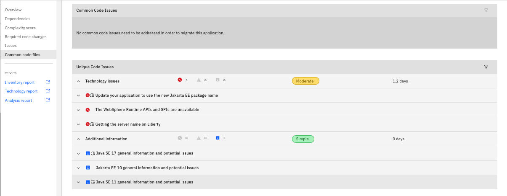
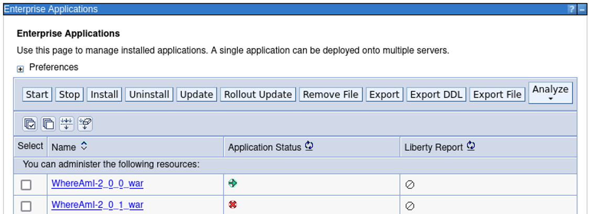

How to demo Modernized Runtime Extension for Java End-to-End - DRAFT

The following guide should help to do a simple end-to-end demo.
Main steps:
1. Demonstrate the application in traditional WAS
2. Analyze the application using Application Modernization Accelerator (AMA) to identify issues when migrating to Liberty
3. Fix modernization issues using the Application Modernization Accelerator Development Tools
4. Create a Liberty cluster in MoRE and deploy the application

It is based on the MoRE TechZone environment:
https://techzone.ibm.com/collection/mo-re--ama-demos-and-environment-2q25-release

## Introduction

MoRE provides the capability to continue using traditional WebSphere Application Server (tWAS) Operational Model to manage Java 17 and Java 8 applications within the same traditional WebSphere administrative environment.

<kbd></kbd>

In this demo, you will show how to extend a WebSphere ND Cell, using the MoRE feature pak, for managed Liberty servers to manage and run Java 17 / Jakarta EE 10 (subset) applications using the familiar WebSphere administrative mode and admin console.

The demo first shows an example application “Mod  Resorts” running in WebSphere ND 9.0.23. The application is a simple Java 8 application using JEE 7 APIs. 

Included with the demo, is a new version of the Mod Reports application that is built using Java 17 and Jakarta 10 EE APIs, which are supported in the managed Liberty Servers (MoRE).  

## Preparation:

1. Create a working directory and download the project

		mkdir -p ~/Student/labs
		git clone https://github.com/LarsBesselmann/sampleProjects.git ~/Student/labs

2. Switch to the directory WhereAmI_MoRE_Demo and uzip the initial project

		cd ~/Student/labs/WhereAmI_MoRE_Demo
		unzip WhereAmI-2.0.0-Project.zip

3. Switch to the WhereAmI directory 

		cd WhereAmI

4. As the modresorts project depends on was_public.jar, you must make it visible to maven to avoid build failures. Run the following command 

        mvn install:install-file -Dfile=./was_dependency/was_public.jar -DpomFile=./was_dependency/was_public-9.0.0.pom

    You should see a success message.

5. Build the application with maven

		mvn clean
		mvn package

	The generated war file is: target/WhereAmI-2.0.0.war

6. Start the Dmgr and the Node agents

		~/IBM/WebSphere/AppServer/profiles/Dmgr01/bin/startManager.sh 
		~/IBM/WebSphere/AppServer/profiles/AppSrv01/bin/startNode.sh
		~/IBM/WebSphere/AppServer/profiles/AppSrv02/bin/startNode.sh
	Access via browser the WebSphere Admin Console via URL: https://localhost:9043/ibm/console, User ID: techzone, password: **IBMDem0s!**

7. Create a tWAS cluster called tWASCluster1 and 2 members, one on each node.

8. Deploy the generated war file to the tWAS cluster, set the context root to **/tWAS**

9. Start the application.

	<kbd></kbd>

	<kbd></kbd>

10. Start the IBM HTTP Server via 

		/home/techzone/IBM/HTTPServer/bin/apachectl start

11. Access the application via IHS: http://localhost:8080/tWAS/WhereAmI

	<kbd></kbd>

12. Reload the page and you should see that the application switches between the two tWAS servers.

	<kbd></kbd>

## Analysis using AMA

1. In AMA, create a workspace named **MoRE_Demo**

2. Download the data collector (tar -zxvf DiscoveryTool-Linux_MoRE_Demo.tgz )

3. run the data collector against the MoRE cell via command

		transformationadvisor-4.3.0/bin/transformationadvisor -w /home/techzone/IBM/WebSphere/AppServer/

4. Wait until the collection has been uploaded and is available in AMA

5. Show in the **Visualization** tab that there are no dependencies to other applications

	<kbd></kbd>

6. Switch to the **Assessment** tab that the application can be migrated to MoRE but has some issues that must be fixed.

	<kbd></kbd>

7. Get more insight about the issues

	<kbd></kbd>

	<kbd></kbd>

	<kbd></kbd>

8. Generate and download the migrationplan so that you can re-use it in AMA Dev Tools

	<kbd></kbd>

## Use AMA Dev Tools to apply automated fixes

1. In a terminal window, switch to the WhereAmI directory and open VS Code

		cd WhereAmI_JavaEE_Project/WhereAmI
		code .

2. Change in the pom.xml file the version from 2.0.0 to 2.0.1

3. Start the AMA Dev Tool modernization wizard for target Liberty

	<kbd></kbd>

4. Upload the AMA generated migration plan into AMA Dev Tools

	<kbd></kbd>

5. Add the generated server.xml file which was generated by AMA and helps to test the application in development on Liberty.

	<kbd></kbd>

6. Take a look at the identified modernization issues which are mainly in the are ap automated fixes

	<kbd></kbd>

	Click on **Run automated fixes** to fix those issues.

7. Click on Rebuild and refresh and you will see that also the self-directed issue has been resolved.

	<kbd></kbd>

## Set up the managed Liberty cluster

1. Create a managed Liberty cluster named managedLibertyCluster1

	<kbd></kbd>

	<kbd></kbd>

2. Create the first cluster member on the first node based on the managed Liberty server template.
	
	<kbd></kbd>

3. Add another cluster member, this time on the sevcond node.

	<kbd></kbd>

	<kbd></kbd>

4. Review the summary to make sure the servers are placed correctly

	<kbd></kbd>

5. Before saving the cluster, take a look at the wsadmin script.

	<kbd></kbd>

6. Save the settings

	<kbd></kbd>

7. CLick on the cluster name

	<kbd></kbd>

8. Review the configuration

	<kbd></kbd>

9. Take a look at the local topology.

	<kbd></kbd>

10. Review the ports and add missing HTTP ports to the virtual hosts

	<kbd></kbd>

	<kbd></kbd>

	<kbd></kbd>

## Deploy the application

1. Select the updated WhereAmI application (which has the version 2.0.1) and select Liberty as target runtime

	<kbd></kbd>

2. Choose the Fast Path deployment and leave the defaults for the name

	<kbd></kbd>

	<kbd></kbd>

3. Map the application to the Liberty cluster and the IBM HTTP Server

	<kbd></kbd>

4. Leave the default host

	<kbd></kbd>

5. Change the context root to **/liberty**

	<kbd></kbd>

6. Review the summary

	<kbd></kbd>

7. Take a look at the wsadmin script

	<kbd></kbd>

8. Finally save the application. It should be listed as stopped.

	<kbd></kbd>

## Start the cluster and test the application

1. Start the cluster

	<kbd></kbd>

2. Review the wsadmin script

	<kbd></kbd>

3. Access the application via IBM HTTP Server

	<kbd></kbd>

4. Reload the page and you should see that it switches been both Liberty instances.

	<kbd></kbd>

**This concludes the demo**
You should have seen how easy it can be to migrate an application from traditional WAS to managed Liberty and that you could use the same operational model in managed Liberty.